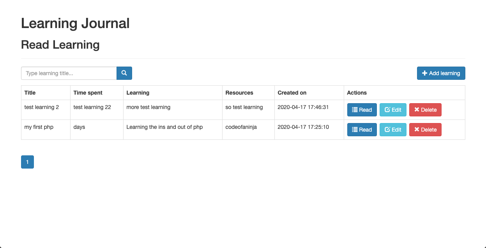
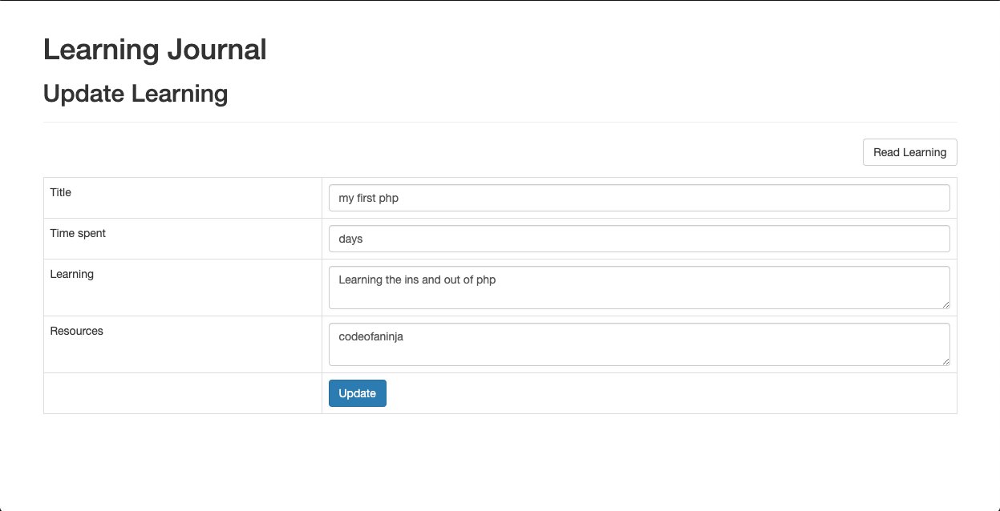

## Learning Journal
***

### What is this app?

A simple web app that helps your write down your learning.  

### Core Objective

Learn how to build a crud app

### How it was built

I built it using PHP, MySQL and Bootstrap 3

### Possible extensions
- Ability to add images and sound
- Ability to add tags
- Ability to sort the titles or by date

### Views
## Index

## Read

## Update

